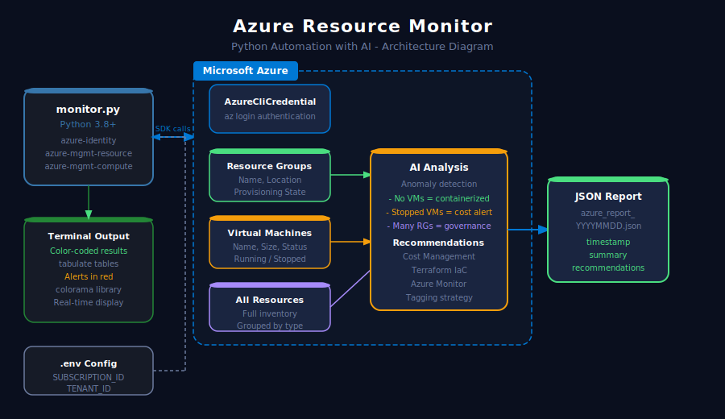
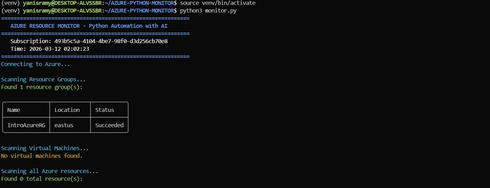

# Azure Resource Monitor - Python Automation with AI


## Overview

A Python automation script that monitors Azure cloud resources in real-time, detects anomalies, generates AI-powered recommendations and produces JSON reports automatically.

This project demonstrates Python scripting skills applied to cloud infrastructure management on Microsoft Azure.

---

## Architecture Diagram



---

## Features

- Scans all Azure Resource Groups with their status and location
- Detects and lists all Virtual Machines with size and running status
- Inventories all Azure resources grouped by type
- Generates intelligent recommendations based on infrastructure analysis
- Exports a detailed JSON report with timestamp
- Color-coded terminal output for better readability

---

## Screenshots

### Monitor running - Resource Groups and VM scan


---

## Tech Stack

| Component | Technology |
|-----------|-----------|
| Language | Python 3.8+ |
| Cloud SDK | Azure SDK for Python |
| Authentication | Azure CLI Credential |
| Resource Management | azure-mgmt-resource |
| Compute Management | azure-mgmt-compute |
| Output Formatting | tabulate, colorama |
| Configuration | python-dotenv |
| Report Format | JSON |

---

## Project Structure
```
AZURE-PYTHON-MONITOR/
├── monitor.py          # Main monitoring script
├── .env                # Azure credentials (not committed)
├── .gitignore
├── requirements.txt    # Python dependencies
├── reports/            # Generated JSON reports (auto-created)
├── screenshots/        # Project screenshots and diagrams
└── README.md
```

---

## Getting Started

### Prerequisites

- Python 3.8+
- Azure CLI installed and logged in
- An active Azure subscription

### 1. Clone the repo
```bash
git clone https://github.com/YanisRamy/AZURE-PYTHON-MONITOR.git
cd AZURE-PYTHON-MONITOR
```

### 2. Create virtual environment
```bash
python3 -m venv venv
source venv/bin/activate
```

### 3. Install dependencies
```bash
pip install -r requirements.txt
```

### 4. Configure environment
```bash
cp .env.example .env
```

Edit `.env` with your Azure credentials:
```
AZURE_SUBSCRIPTION_ID=your-subscription-id
AZURE_TENANT_ID=your-tenant-id
RESOURCE_GROUP=your-resource-group
```

### 5. Login to Azure and run
```bash
az login
python3 monitor.py
```

---

## Sample Output
```
============================================================
   AZURE RESOURCE MONITOR - Python Automation with AI
============================================================
   Subscription: xxxxxxxx-xxxx-xxxx-xxxx-xxxxxxxxxxxx
   Time: 2026-03-12 02:02:23
============================================================
Connecting to Azure...

Scanning Resource Groups...
Found 1 resource group(s)

Scanning Virtual Machines...
No virtual machines found.

Scanning all Azure resources...
Found 5 total resource(s)

Running AI analysis...
AI Recommendations:
  1. No VMs detected - infrastructure is fully containerized (good practice)
  2. Enable Azure Cost Management alerts to monitor spending
  3. Use Terraform to manage all resources as Infrastructure as Code
  4. Enable Azure Monitor and set up alerts for critical resources

Report saved: reports/azure_report_20260312_020226.json
============================================================
   MONITORING COMPLETE
============================================================
```

---

## Generated Report Format
```json
{
  "timestamp": "2026-03-12T02:02:26",
  "subscription_id": "xxxxxxxx-xxxx-xxxx-xxxx-xxxxxxxxxxxx",
  "summary": {
    "resource_groups": 1,
    "virtual_machines": 0,
    "total_resources": 5,
    "resource_types": {
      "virtualMachines": 2,
      "storageAccounts": 1
    }
  },
  "recommendations": [
    "No VMs detected - infrastructure is fully containerized",
    "Enable Azure Cost Management alerts"
  ],
  "status": "completed"
}
```

---

## Azure Resources Monitored

| Resource Type | Description |
|---------------|-------------|
| Resource Groups | Lists all groups with location and status |
| Virtual Machines | Detects running, stopped and deallocated VMs |
| All Resources | Full inventory grouped by resource type |

---

## Author

Yanis Ramy
- GitHub: https://github.com/YanisRamy
- Email: yanisramy4@gmail.com
