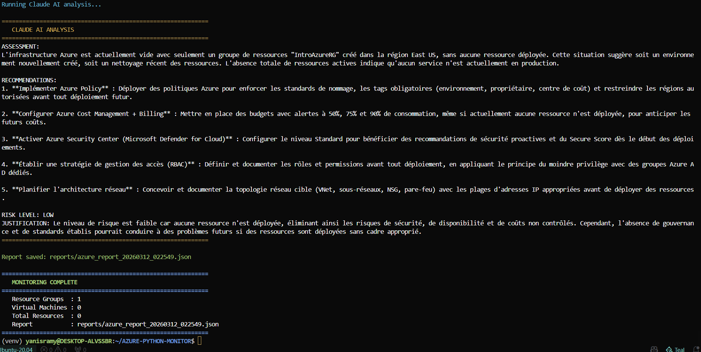

# Azure Resource Monitor - Python Automation with Claude AI


## Overview

A Python automation script that monitors Azure cloud resources in real-time, then sends the infrastructure data to **Claude AI (Anthropic)** which generates expert recommendations in French, detects anomalies and evaluates the risk level automatically.

This project demonstrates Python scripting skills applied to cloud infrastructure management on Microsoft Azure, combined with real AI integration.

---

## Architecture Diagram


---

## How it works

1. The script connects to Azure using Azure CLI Credential
2. It scans all Resource Groups, Virtual Machines and resources
3. The infrastructure data is sent to Claude AI via the Anthropic API
4. Claude AI returns a professional assessment, 5 recommendations and a risk level
5. A JSON report is saved automatically with timestamp

---

## Screenshots

### Script running - Azure scan in progress


### Claude AI analysis - Real AI recommendations


---

## Tech Stack

| Component | Technology |
|-----------|-----------|
| Language | Python 3.8+ |
| Cloud SDK | Azure SDK for Python |
| AI Engine | Claude AI - Anthropic API |
| Authentication | Azure CLI Credential |
| Resource Management | azure-mgmt-resource |
| Compute Management | azure-mgmt-compute |
| Output Formatting | tabulate, colorama |
| Configuration | python-dotenv |
| Report Format | JSON |

---

## Project Structure
```
AZURE-PYTHON-MONITOR/
├── monitor.py          # Main monitoring script
├── .env                # Azure + Anthropic credentials (not committed)
├── .gitignore
├── requirements.txt    # Python dependencies
├── reports/            # Generated JSON reports (auto-created)
├── screenshots/        # Project screenshots and diagrams
└── README.md
```

---

## Getting Started

### Prerequisites

- Python 3.8+
- Azure CLI installed and logged in
- An active Azure subscription
- An Anthropic API key (https://console.anthropic.com)

### 1. Clone the repo
```bash
git clone https://github.com/YanisRamy/AZURE-PYTHON-MONITOR.git
cd AZURE-PYTHON-MONITOR
```

### 2. Create virtual environment
```bash
python3 -m venv venv
source venv/bin/activate
```

### 3. Install dependencies
```bash
pip install -r requirements.txt
```

### 4. Configure environment

Create a `.env` file with your credentials:
```
AZURE_SUBSCRIPTION_ID=your-subscription-id
AZURE_TENANT_ID=your-tenant-id
ANTHROPIC_API_KEY=your-anthropic-api-key
```

### 5. Login to Azure and run
```bash
az login
python3 monitor.py
```

---

## Claude AI Output Example
```
ASSESSMENT:
L'infrastructure Azure est actuellement vide avec seulement un groupe
de ressources "IntroAzureRG" cree dans la region East US, sans aucune
ressource deployee. Cette situation suggere soit un environnement
nouvellement cree, soit un nettoyage recent des ressources.

RECOMMENDATIONS:
1. Implementer Azure Policy pour enforcer les standards de nommage
2. Configurer Azure Cost Management avec alertes a 50%, 75% et 90%
3. Activer Azure Security Center (Microsoft Defender for Cloud)
4. Etablir une strategie RBAC avec le principe du moindre privilege
5. Planifier l'architecture reseau (VNet, sous-reseaux, NSG)

RISK LEVEL: LOW
JUSTIFICATION: Le niveau de risque est faible car aucune ressource
n'est deployee, eliminant ainsi les risques de securite et de couts.
```

---

## Generated Report Format
```json
{
  "timestamp": "2026-03-12T02:25:49",
  "subscription_id": "xxxxxxxx-xxxx-xxxx-xxxx-xxxxxxxxxxxx",
  "summary": {
    "resource_groups": 1,
    "virtual_machines": 0,
    "total_resources": 0
  },
  "ai_analysis": "ASSESSMENT:\n...\nRECOMMENDATIONS:\n...\nRISK LEVEL: LOW",
  "status": "completed"
}
```

---

## Author

Yanis Ramy
- GitHub: https://github.com/YanisRamy
- Email: yanisramy4@gmail.com
